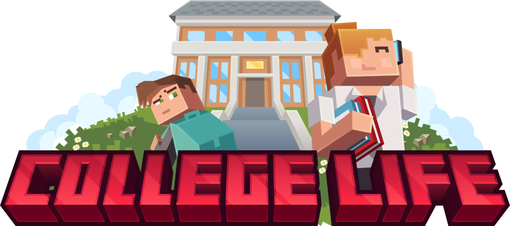
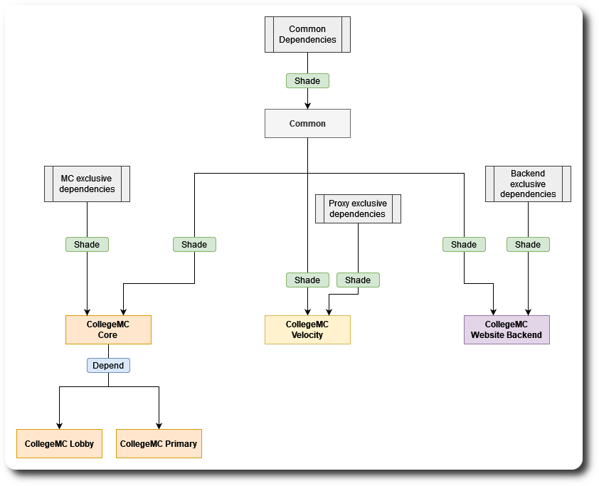

---

Multi module project of CollegeMC containing

- Common code
- Minecraft common code
- Velocity common code
- Minecraft lobby implementation
- Minecraft primary server implementation

---

## Quick start

Run the `paper-nms:init` maven lifecycle to create remapped nms sources.
This has to be done only once and when updating to a new
Minecraft version.

The project can be build by running `package` or `install` on either the
parent or each child module respectively.

---

## Dependency tree

- Common depends on only external dependencies
- CollegeMC-Core depends on Common and MC dependencies
- Velocity-Core depends on Common and Velocity dependencies
- CollegeMC-Lobby depends on CollegeMC-Core
- CollegeMC-Primary depends on CollegeMC-Core

---

## Running the server

Before starting the server you need to make sure you have:

- Redis instance
- MongoDB instance

Using Docker is strongly recommended, especially if you are on
Windows.

After that you need `Core` and either `Lobby` or `Primary` on the server.
You also need to install `ProtocolLib` as its a hard dependency.